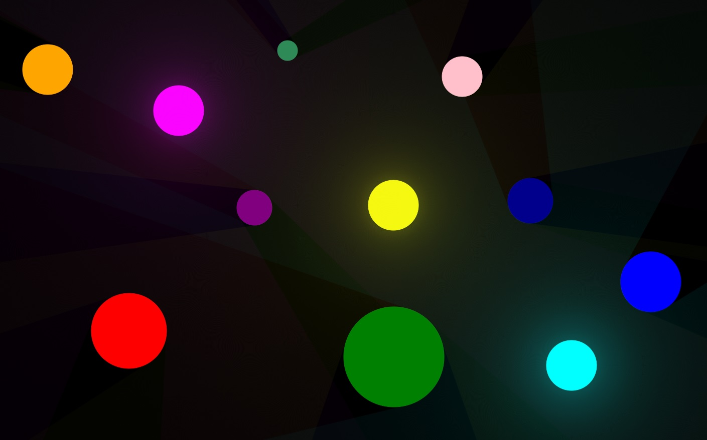

# Simple 2D Ray Tracing

  
*A simple JavaFX application demonstrating real-time 2D ray tracing.*

## Overview
This is a lightweight 2D ray tracing simulation built with JavaFX. The application allows users to interact with dynamic light sources and objects in real-time, visualizing how light interacts with the environment.

## Features
- **Real-time Ray Tracing** — Simulates light behavior with object interactions.
- **Interactive Environment** — Move objects, control speed and toggle full-screen mode.
- **Optimized Rendering** — Utilizes JavaFX Canvas for smooth performance.
- **Light and Object Manipulation** — Select objects and control their movement, affecting real-time ray tracing.

## Controls
| Key | Action |
|-----|--------|
| F11 | Toggle full-screen mode |
| [ | Decrease object movement speed (by factor of 2) |
| ] | Increase object movement speed (by factor of 2) |
| W/A/S/D | Move controlled object |
| Left Mouse Click | Select an object to control |

## How to Run
1. Download the latest release: [Releases](https://github.com/r0masaN/Simple2DRayTracing/releases)
2. Extract the archive and run the executable file:
   ```sh
   your_project.exe
   ```
3. Enjoy real-time ray tracing!

## Demo


## Future Improvements
- Adding more complex light interactions (reflections, refractions)
- Optimizing performance for larger scenes
- Expanding object variety

## License
[MIT License](LICENSE)
