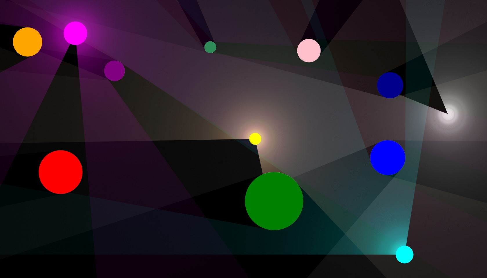

# Simple 2D Ray Tracing

  
*A simple JavaFX application demonstrating real-time 2D ray tracing.*

## Overview
This is a lightweight 2D ray tracing simulation built with JavaFX. The application allows users to interact with dynamic light sources and objects in real-time, visualizing how light interacts with the environment.

## Features
- **Real-time Ray Tracing** — Simulates light behavior with object interactions.
- **Interactive Environment** — Move objects, control speed and toggle full-screen mode.
- **Optimized Rendering** — Utilizes JavaFX Canvas for smooth performance.
- **Light and Object Manipulation** — Select objects and control their movement, affecting real-time ray tracing.

## Controls
| Key | Action |
|-----|--------|
| F11 | Toggle full-screen mode |
| ESC | Close app |
| ↓/↑ | Decrease/increase object movement speed (from 2 to 16 pixels/step in increments of 2) |
| ←/→ | Decrease/increase light spreading speed (from 2 to 16 pixels/step in increments of 2) |
| Left Mouse Click | Select an object to control |
| W/A/S/D | Move controlled object |
| R/T | Decrease/increase controlled object's radius (from 2 to 16 pixels in increments of 1) |
| O/P | Decrease/increase controlled object's opacity (from 0 to 1 pixels in increments of 0.02) |
| Z/X | Decrease/increase controlled light source's light rays distance (from 0 to 2500 pixels in increments of light spreading speed) |
| Q/E | Decrease/increase controlled light source's light rays opacity (from 0 to 1 pixels in increments of 0.002) |
| F | Toggle controlled light source (on/off) |

## How to Run
1. Download the [latest release](https://github.com/r0masaN/Simple2DRayTracing/releases/tag/v0.1.0)
2. Extract the archive and run the executable file (2DRayTracingDemo.exe)
3. Enjoy real-time ray tracing!

## Demo

## Future Improvements
- Adding more complex light interactions (reflections, refractions)
- Optimizing performance for larger scenes
- Expanding object variety

## License
[MIT License](LICENSE)
